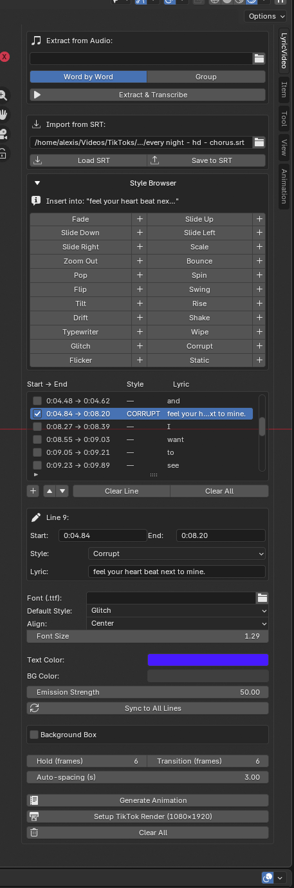

# Lyric Video Blender

A Blender addon that turns an audio or video file into a fully animated lyric video — inside Blender. It separates the vocals, transcribes every word with precise timestamps, and populates the lyric list ready for animation.

---

## Requirements

- Blender 3.0 or newer
- Python 3.11 in a virtual environment (venv) with the ML dependencies installed
- A GPU is strongly recommended (CUDA). CPU works but transcription is slow.

The addon ships with `ml_pipeline.py`, which is run as a subprocess using the venv Python — Blender's built-in Python is not used for the ML steps.

---

## Installation

### 1. Set up the Python environment

```bash
python3.11 -m venv venv
source venv/bin/activate
pip install -r requirements.txt
```

> **Python 3.11 is required.** whisperx does not support Python 3.12 or higher.

For CUDA support, install PyTorch with your CUDA version before the rest:
```bash
pip install torch torchaudio --index-url https://download.pytorch.org/whl/cu121
pip install whisperx demucs ffmpeg-python
```

### 2. Install the Blender addon

1. Run `build.sh` to produce `lyric_video_blender.zip`
2. Open Blender → **Edit → Preferences → Add-ons → Install**
3. Select `lyric_video_blender.zip`
4. Enable **Lyric Video Blender**
5. In the addon preferences, set **Python Binary (venv)** to the Python binary inside your venv (e.g. `/home/you/venv/bin/python`)

Open the 3D Viewport, press **N**, and click the **LyricVideo** tab.

---

## Model Downloads

On the first run of **Extract & Transcribe**, the following models are downloaded automatically and cached for all future runs:

| Model | Size | Cache location |
|---|---|---|
| Whisper large-v3 | ~3 GB | `~/.cache/huggingface/hub/` |
| WhisperX alignment model (English) | ~1.2 GB | `~/.cache/huggingface/hub/` |
| Demucs htdemucs | ~80 MB | `~/.cache/torch/hub/` |

The first run will take several minutes depending on your connection. Subsequent runs are instant.

---

## Panel



---

## Quick Start

1. Click **Setup TikTok Render** to configure 1080×1920 @ 30fps and create a camera
2. Under **Extract from Audio**, pick your audio or video file
3. Choose **Word by Word** or **Group** (N words per line)
4. Click **Extract & Transcribe** — Blender stays usable while it runs
5. When done, the lyric list populates automatically
6. Fix any mis-transcribed words in the lyric list or **Edit Selected Line**
7. Open the **Style Browser** to assign animation styles to lines
8. Set your font, colors, and timing
9. Click **Generate Animation**
10. Add your audio in the **Video Sequence Editor**, then render with Ctrl+F12

---

## Panel Overview

### Extract from Audio

| Field | Description |
|---|---|
| **Audio / Video** | Path to the input file. Supports mp3, wav, flac, m4a, mp4, mkv, and more. |
| **Mode** | **Word by Word** — one lyric line per word. **Group** — N words per lyric line. |
| **Words per Line** | How many words to group (Group mode only). |
| **Extract & Transcribe** | Runs Demucs vocal separation followed by WhisperX forced-alignment transcription. A `vocals.wav` is saved next to the input file in a folder named after it. |
| **Cancel** | Stops the running pipeline immediately. |

The panel shows live stage labels as the pipeline runs: *Loading models → Separating vocals → Transcribing → Aligning timestamps → Done.*

### Import from SRT

Point the file picker at any `.srt` file and click **Load SRT** to populate the lyric list from existing subtitles. Supports UTF-8, Windows line endings, HTML tags, and SSA/ASS positioning tags.

Click **Save to SRT** to export the current lyric list back out as an SRT file.

### Style Browser

A collapsible grid below the SRT importer. Click any style name to preview it in the viewport — a temporary object is created and animated. Press **Space** to play. Click the same style again to dismiss.

Check one or more lines in the lyric list, then click **+** next to a style to apply it to all checked lines at once. If no lines are checked, it applies to the currently highlighted line.

| Style | Description |
|---|---|
| **Fade** | Fades in and out with no motion |
| **Slide Up** | Slides in from below, exits upward |
| **Slide Down** | Slides in from above, exits downward |
| **Slide Left** | Slides in from the left, exits right |
| **Slide Right** | Slides in from the right, exits left |
| **Scale** | Scales up from a tiny point, shrinks out |
| **Zoom Out** | Starts huge and shrinks down to normal size |
| **Bounce** | Drops from above with a small bounce on landing |
| **Pop** | Scales up with an overshoot past full size, then settles |
| **Spin** | Full 360° Z-axis rotation on entry and exit |
| **Flip** | Card-flip on the Y axis |
| **Swing** | Pendulum swing on the Z axis into place |
| **Tilt** | Tilts in from an angle, straightens out |
| **Rise** | Fades in and slowly floats upward while held on screen |
| **Drift** | Fades in and lazily drifts to the right |
| **Shake** | Rapid horizontal jitter on entry, then holds still |
| **Typewriter** | Text reveals left to right, fades out at the end |
| **Wipe** | Curtain wipes in from the left, wipes back out on exit |
| **Glitch** | Random position jitter burst then snaps to rest |
| **Corrupt** | Scale and rotation spasms then snaps to rest |
| **Flicker** | Rapid visibility strobe on entry |
| **Static** | Alpha strobes erratically before settling |

### Lyric List

Each row shows a checkbox, `Start → End`, style, and lyric text. Clicking a row selects it and jumps the playhead to that line's start time.

| Button | Action |
|---|---|
| `+` | Add a blank line at the end |
| **Clear Line** | Remove the selected line |
| `↑` / `↓` | Reorder the selected line |
| **Clear All** | Remove all lines from the list |

Check the checkbox on any row to include it in a batch style apply from the Style Browser.

### Edit Selected Line

Fields for the currently highlighted row:

- **Start** — `M:SS` or decimal seconds (e.g. `1:30` or `90.5`). Leave blank to auto-space.
- **End** — End timestamp in the same format. Used to drive the fade-out; capped automatically if it would overlap the next line.
- **Style** — Per-line style override. `— (use default)` falls back to the Default Style.
- **Lyric** — The text shown on screen. Edit here to fix transcription mistakes.

### Appearance

| Setting | Description |
|---|---|
| **Font (.ttf)** | Path to a `.ttf` or `.otf` font file. Leave blank for Blender's built-in font. |
| **Default Style** | Fallback style for any line with no per-line override. |
| **Align** | Text alignment: Center, Left, or Right. |
| **Font Size** | Size of the text in Blender units. |
| **Text Color** | RGB color of the text. Updates live on existing objects. |
| **BG Color** | World background color. Updates live. |
| **Emission Strength** | Text brightness. Values above 1.0 produce a glow when bloom is enabled. Updates live. |

**Sync to All Lines** — pushes the current font, size, alignment, color, and emission strength to all already-generated objects without touching keyframes or text content.

### Background Box

Toggles a filled rectangle behind each lyric line.

| Setting | Description |
|---|---|
| **Background Box** | Enable or disable the box. Updates live on existing objects. |
| **Fill Color** | Color of the background rectangle. Updates live. |
| **Fill Opacity** | Transparency of the fill (0 = invisible, 1 = solid). |
| **Pad X / Pad Y** | Horizontal and vertical padding between the text and the box edge. |
| **Border** | Enable a border outline around the fill. |
| **Border Color** | Color of the border. Updates live. |
| **Border Opacity** | Transparency of the border. |
| **Border Width** | Thickness of the border in Blender units. |

Padding and border width take effect on the next **Generate Animation**.

### Timing

| Setting | Description |
|---|---|
| **Hold (frames)** | How long the text stays fully visible. Shortened automatically if the next line starts sooner. |
| **Transition (frames)** | How many frames the in and out animations take. |
| **Auto-spacing (s)** | Seconds between lines when no timestamp is given. |

### Actions

| Button | Action |
|---|---|
| **Generate Animation** | Clears any previously generated objects and builds fresh animated text objects from the lyric list. Safe to click multiple times. |
| **Setup TikTok Render** | Sets render resolution to 1080×1920 at 30fps and creates an orthographic camera. Does not change your render engine. |
| **Clear All** | Removes all generated text objects and materials from the scene. |

---

## Output Files

When **Extract & Transcribe** runs on `/path/to/song.mp3`, a folder `/path/to/song/` is created containing:

- `vocals.wav` — the separated vocal stem from Demucs
- `song.srt` — a word-level SRT file, automatically loaded into the Import from SRT field

Use **Save to SRT** to export the lyric list (after any edits) to an SRT file of your choice.

---

## Tips

- **Fix words before generating** — use Edit Selected Line to correct mis-transcribed words. The timestamps come from forced alignment, so they stay accurate even after text edits.
- **Mix styles freely** — each line has its own style override. Use Default Style as your baseline and only override lines that need something different.
- **Batch style apply** — check multiple lines in the lyric list, then click **+** on a style to apply it to all of them at once.
- **Sync without regenerating** — after generating, tweak font, size, or colors and click **Sync to All Lines** to update everything without touching keyframes.
- **Glow effect** — raise Emission Strength above 1.0 and enable bloom (EEVEE: Render Properties → Bloom; Cycles: glare compositor node).
- **Custom fonts** — any `.ttf` or `.otf` works. Google Fonts, DaFont, and Font Squirrel are good free sources.
- **Camera** — Setup TikTok Render creates an orthographic camera. Adjust `ortho_scale` in camera properties to zoom in or out.
- **Re-extract freely** — clicking Extract & Transcribe always replaces the lyric list, so you can re-run with different grouping settings without cluttering the scene.

---

## Project Structure

```
lyric-video-blender/
├── lyric_video_blender/
│   ├── __init__.py      — bl_info, AddonPreferences, register/unregister
│   ├── typo.py          — animation styles, keyframe logic, PropertyGroups
│   ├── operators.py     — all operators including async audio extraction
│   ├── panels.py        — single panel with all sections inline
│   └── ml_pipeline.py   — ML script (Demucs + WhisperX), run as subprocess
├── build.sh             — builds lyric_video_blender.zip for installation
├── requirements.txt     — Python dependencies for the venv
└── README.md
```

---

## License

Do whatever you want with it.
